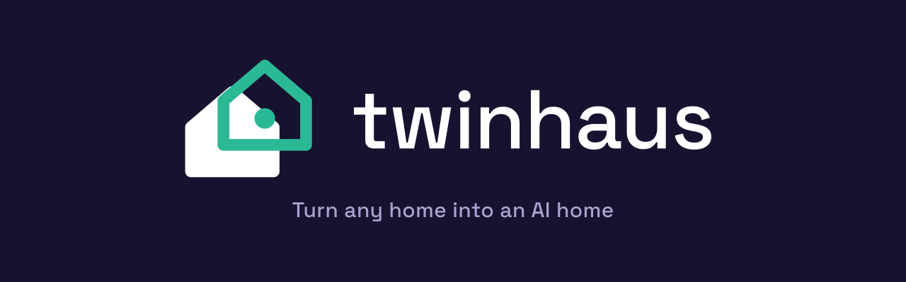

<p align="center">
  
</p>

<p align="center">
  <b>Turn any home into an AI home.</b><br/>
  An open-source 3D digital twin of your house, with an AI agent as its brain.<br/>
  Built on top of <a href="https://www.home-assistant.io/">Home Assistant</a>.
</p>

<p align="center">
  
  
  
  
</p>

<p align="center">
  
</p>

---

## What is Twinhaus?

Twinhaus is a live, walkable 3D replica of your real home that runs in the browser. Every smart device in your house appears in the model exactly where it is in real life, and an AI agent controls all of it through natural language.

Say _"dim the living room and lock the back door"_ and watch it happen in the twin as it happens in your house.

Your home already has the data. Home Assistant already talks to 2000+ devices. What's missing is a spatial, intelligent way to see and control it all. That's Twinhaus.

## Why?

- **Dashboards are lists. Homes are spaces.** A motion alert means more when you see _which door_ it came from, in 3D.
- **Works with the home you already have.** Old house, rented apartment, zero smart devices, start with a floor plan and grow from there.
- **Build it from a photo.** No floor plan and no LiDAR? Point your phone at a room, the AI reads its size and the smart devices in it, and it becomes an editable room in the twin. Scan room by room to grow the whole home.
- **A brain, not just a chatbot.** A central brain supervises every connected system at once, settles the house when you leave, trims waste, and learns your daily rhythms into routines you can save with one tap.
- **Add devices as they appear.** A "Found near you" tray surfaces devices Home Assistant has discovered but not yet configured, one click adds them and drops them straight into the twin. See [docs/DISCOVERY.md](docs/DISCOVERY.md).
- **Simulate before you buy.** Place a virtual camera or sensor in the twin, check its coverage, _then_ spend money.
- **Local-first, any model.** Runs against your own Home Assistant instance. Bring your own LLM, Anthropic or OpenAI in the cloud, fully local via Ollama, or any OpenAI-compatible endpoint (OpenRouter, Groq, Together, LM Studio, vLLM) via the Custom provider.
- **HA-optional, not HA-hostile.** Home Assistant gives the widest device coverage, but it's one backend behind a small provider interface, not a hard requirement. Explore a simulated home with **no hub at all** (Demo), or control real devices without HA via **MQTT (zigbee2mqtt)** or **Matter** (through a local companion service). See [docs/BACKENDS.md](docs/BACKENDS.md).

## How it works

The stack, top to bottom:

1. Browser: the 3D twin viewer (Three.js) and chat control (talk to your home).
2. Twinhaus core: the twin state engine (rooms, devices) and the AI agent (LLM plus tool calls).
3. Device backend, over its API: Home Assistant (2000+ integrations) by default, or MQTT, Matter, or Demo.
4. The backend talks to the real Zigbee, Matter, and WiFi devices.

Twinhaus never talks to hardware directly, a device backend is always the device layer. Home Assistant is the default (and widest) backend; MQTT, Matter, and a hardware-free Demo are others, all behind one provider interface ([docs/BACKENDS.md](docs/BACKENDS.md)). We are the 3D + AI layer on top.

See [docs/ARCHITECTURE.md](docs/ARCHITECTURE.md) for the full design.

## Getting started

> Note: Twinhaus is in early development. The MVP targets: floor plan editor to 3D extrusion to live Home Assistant device states to chat control of lights.

```bash
git clone https://github.com/Jagga-tech/twinhaus.git
cd twinhaus
npm install
npm run dev
```

Then open `http://localhost:5173`, draw your floor plan, and connect your Home Assistant instance (Settings to paste your HA URL + long-lived access token).

## Roadmap

- [x] **Phase 1, MVP**: 2D floor plan editor, 3D extrusion, HA connection, live light/sensor states, chat control
- [x] **Phase 2**: RoomPlan/capture import, more device types + click-to-control, per-room energy heatmap, spatial security timeline, agent automations
- [x] **Phase 3**: Simulation mode with coverage viz, device recommendation wizard, local LLM support (Ollama), `.glb`/`.gltf` + photo import, HA add-on packaging
- [x] **Phase 4**: Built-in device model library, home templates, MCP server
- [x] **Discovery**: "Found near you" tray, one-click add of HA-discovered devices with instant 3D placement ([docs](docs/DISCOVERY.md))
- [x] **Catalog**: searchable cross-brand catalog of devices you can add, feeding the recommendation wizard and the agent ([docs](docs/CATALOG.md))
- [x] **Agent safety loop**: risk classification, confirmation gate, circuit breaker, action budget, and verify-after-act so the agent can never cause a serious issue while operating ([docs](docs/SAFETY.md))
- [x] **Self-healing connection**: auto-reconnect with exponential backoff, subscription re-establishment, and snapshot resync so a Home Assistant restart or network blip never leaves the twin stale ([docs](docs/RESILIENCE.md))
- [x] **Whole-house structure**: multi-floor levels with a floor switcher, stacked 3D view, per-floor + whole-home summaries, building-type starts, and scan-by-HA-floor ([docs](docs/STRUCTURE.md))
- [x] **Guided onboarding**: a first-run WelcomeFlow that threads connect to build to control to locate to talk into one journey ([workflow](docs/WORKFLOW.md))
- [x] **Scan your home**: no drawing, generate a room per Home Assistant area and auto-place every device where it already lives ([docs](docs/HOME-SCAN.md))
- [x] **Position from distance**: trilaterate a device's live spot within a room from Bluetooth ranging (ESPHome proxies / ESPresense / Bermuda), with an honest confidence halo ([docs](docs/POSITIONING.md))
- [x] **Central brain**: one supervisor over every connected backend at once, with Off / Suggest / Autopilot modes; safe actions (lights off when away, lock up, eco climate, close covers while heating) can run themselves, anything touching security or comfort is only ever suggested
- [x] **Learns your habits**: watches how the home is actually used, spots the routines in it (the evening dim, the morning warm-up), and offers them back to run now or save as a scene
- [x] **Build from a photo**: turn a phone photo of a room into an editable room plus the smart devices spotted in it, works with Claude, GPT, a local Ollama vision model, or any custom endpoint, with a clear message when a chosen model can't read images
- [x] **Any model**: four built-in providers (Anthropic, OpenAI, Ollama) plus a Custom OpenAI-compatible provider so you can point at OpenRouter, Groq, Together, LM Studio, vLLM, or your own gateway

### Next up

- [ ] **Fire learned routines on time**: a small scheduler so a saved routine runs at its learned hour, not just when you tap it
- [ ] **Sharper photo sizing**: drop several photos of one room from different angles so the size estimate triangulates instead of guessing from one shot
- [ ] **Test connection**: a one-tap check next to the model field that confirms the endpoint, model, and key actually work before you rely on them
- [ ] **LLM-as-brain option**: let the central brain reason with your LLM for open-ended situations, alongside today's fast, deterministic rulebook

Full details in [docs/ROADMAP.md](docs/ROADMAP.md).

## Contributing

Contributions are very welcome, this project is being built in the open from day one. Read [CONTRIBUTING.md](CONTRIBUTING.md) to get started, or grab an issue labeled `good first issue`.

## License

[MIT](LICENSE), free to use, fork, and build on.

---

<p align="center">Made in Hayward, CA</p>
