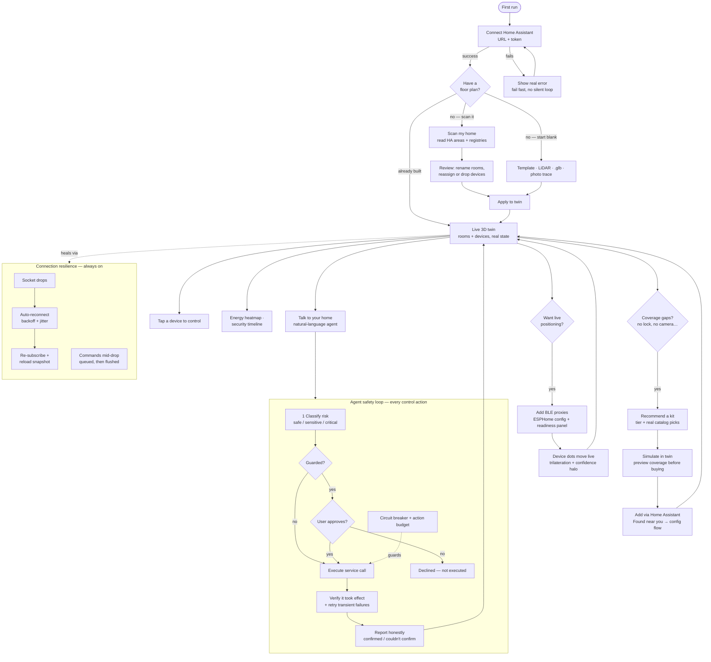
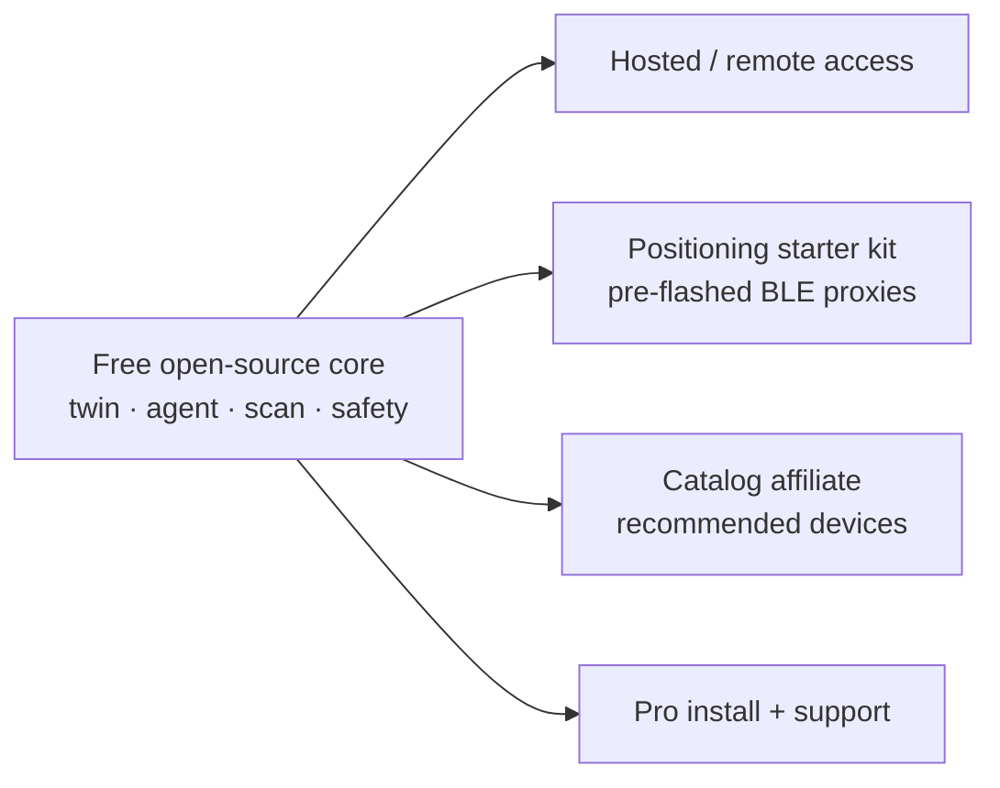

# Twinhaus — the blended workflow

One journey that stitches every shipped feature into a single product story:
**connect → scan → live twin → recommend → locate → talk**, with safety and resilience running
underneath the whole time. Each node maps to code that already exists — this is a build spec for
the connective tissue (a guided first-run flow), not new subsystems.

## The end-to-end flow

## Node → code map (what to reuse, not rebuild)

| Flow node                       | Lives in                                                                                     |
| ------------------------------- | -------------------------------------------------------------------------------------------- |
| Connect Home Assistant          | `apps/web` Settings, `packages/ha-bridge` `HaClient.connect`                                 |
| Scan my home                    | `packages/ha-bridge` registry reads · `apps/web/src/lib/homeScan.ts`                         |
| Review (rename/reassign/drop)   | `homeScan.ts` `applyReview` · `HomeScanPanel`                                                |
| Template · LiDAR · .glb · photo | `templates.ts` · `twinIo.ts` · `ImportPanel`                                                 |
| Live 3D twin + tap to control   | `components/viewer/*` · `deviceControl.ts`                                                   |
| Energy / security views         | `energy.ts` · security timeline                                                              |
| Recommend a kit                 | `recommendations.ts` · `RecommendationWizard`                                                |
| Catalog picks                   | `packages/discovery` `catalog.ts` · `DeviceCatalog`                                          |
| Simulate before buying          | `SimulationPanel` · `CoverageViz` · virtual devices                                          |
| Add via HA (Found near you)     | `packages/discovery` flows · `FoundNearYou`                                                  |
| BLE proxies + readiness         | `docs/positioning/*.yaml` · `positioningSources.ts` `positioningStatus` · `PositioningPanel` |
| Live device dots                | `positioning.ts` · `useLivePositioning` · `DeviceMarker`                                     |
| Talk to your home (agent)       | `packages/agent` · `ChatPanel`                                                               |
| Safety loop                     | `packages/agent` `safety.ts` + `agent.ts` · `verifyAction.ts`                                |
| Connection resilience           | `packages/ha-bridge` `backoff.ts` + `client.ts`                                              |

## The one gap this exposes

Every node above is built — but they live in **separate tabs the user has to discover**. The single
missing piece is the **spine**: a first-run `WelcomeFlow` that walks a new user through
connect → scan → tour → gap-check → positioning nudge → first agent command, each step reusing the
components in the table. That is the difference between "13 features on `main`" and "a product that
sells itself in the first session" — and it's the recommended next build.

## Monetization edges (free core, paid rim — the Nabu Casa model)

